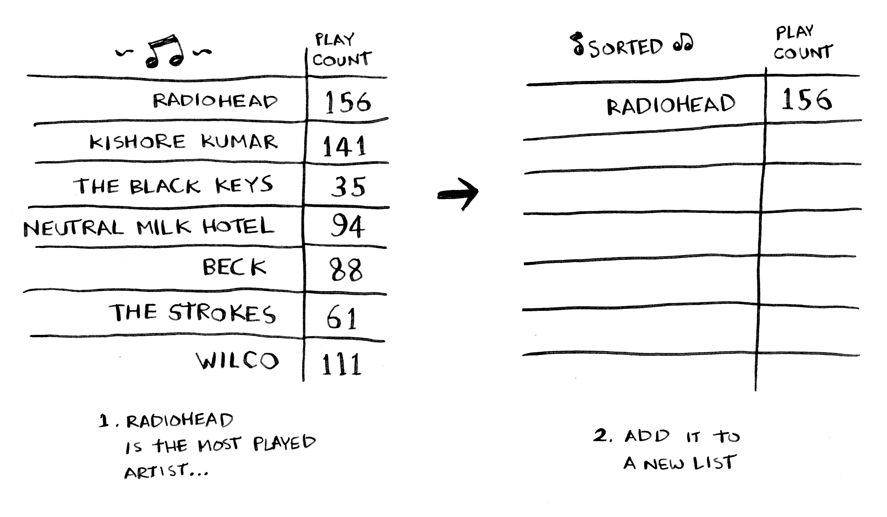
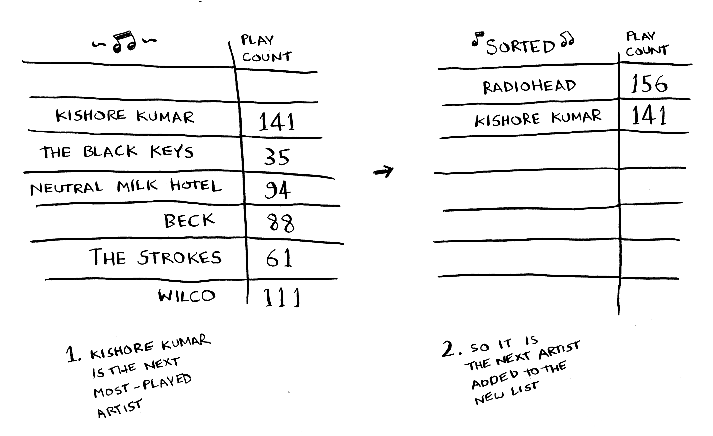

# Selection Sort

Esse é um algoritmo para ordenar uma lista de elementos

A cada tentativa, a quantidade de elementos é reduzida pela metade, fazendo com que a busca seja rápida, independente do tamanho da lista que temos.

O tempo de execução desse algoritmo é: <strong>O(n²)</strong>

Apesar de existir algo melhor, ele serve como base para entendimento do algoritmo Quicksort

